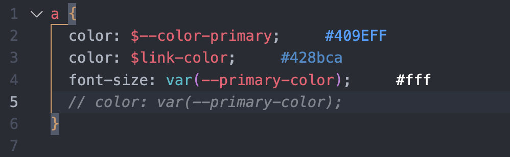

# show-theme-colors

## Features

Show programmers the values of less/scss/css variables in the code

## Extension Settings

This extension contributes the following settings:

* `show-theme-variables.themeFilePath`: Theme file store path.
